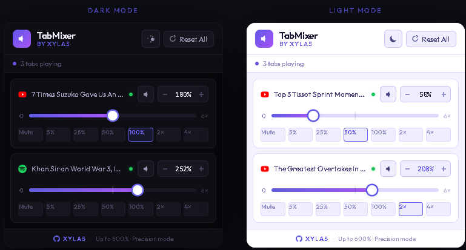

<div align="center">


# TabMixer

### Per-Tab Volume Controller for Chrome

**Control the volume of every browser tab independently.**  
Silence one tab, boost another to 600%, all without touching your system volume.

[](https://github.com/xylas007)
[](https://developer.chrome.com/docs/extensions/mv3/)
[](LICENSE)
[](https://github.com/xylas007)

</div>

---

## 📸 Preview

> **Dark Mode** and **Light Mode** — switch instantly with one click.

<!-- Replace this line with your actual screenshot after taking one from preview.html -->


---

## ✨ Features

| Feature | Description |
|---|---|
| 🎚️ **Per-Tab Volume** | Set a different volume level for every open tab independently |
| 🔊 **Up to 600% Boost** | Amplify quiet tabs far beyond the system limit using Web Audio API |
| 🎯 **Precision Slider** | Dual-zone slider — left half for fine 0–100% control, right half for boost |
| ⚡ **Quick Presets** | One-click presets: Mute, 5%, 25%, 50%, 100%, 2×, 4× |
| ➕ **Fine Tune** | `−` / `+` buttons to step volume in 5% increments |
| 🔇 **Smart Mute** | Mute any tab instantly; unmuting restores your previous volume |
| 🌙 **Dark / Light Mode** | Toggle themes — preference saved automatically |
| 🎵 **Audio-Only View** | Only shows tabs that are currently playing audio — no clutter |
| 💾 **Volume Memory** | Volumes are saved per-tab and restored when you reopen the extension |
| 🧹 **Reset All** | One-click reset of all tabs back to 100% |

---

## 🚀 Installation

### From Source (Developer Mode)

1. **Download** this repository — click `Code → Download ZIP` and extract it
2. Open Chrome and go to `chrome://extensions`
3. Enable **Developer mode** (toggle in the top-right corner)
4. Click **Load unpacked**
5. Select the extracted `tabmixer-new` folder
6. The TabMixer icon will appear in your Chrome toolbar — pin it for easy access

---

## 🎮 How to Use

1. **Open any tab with audio** (YouTube, Spotify, podcast, etc.)
2. **Click the TabMixer icon** in the Chrome toolbar
3. Only tabs currently playing audio will appear in the popup
4. **Drag the slider** to adjust volume:
   - Left half (0–50% of slider) = fine control from **0% to 100%**
   - Right half (50–100% of slider) = boost from **100% to 600%**
5. Use the **preset buttons** for instant jumps: `Mute · 5% · 25% · 50% · 100% · 2× · 4×`
6. Use **`−` / `+`** buttons for precise ±5% adjustments
7. Click the **speaker icon** to mute/unmute (restores previous volume)
8. Click **☀️/🌙** in the header to toggle light/dark mode
9. Click **Reset All** to restore every tab to 100%

---

## 🛠️ How It Works

TabMixer uses the **Web Audio API** to intercept and reroute audio from each tab through a `GainNode` — a signal amplifier/attenuator that can scale audio both below and above 100%.

```
Browser Tab Audio
       │
       ▼
 MediaElementSource     ← Web Audio API hooks into <video>/<audio> elements
       │
       ▼
    GainNode            ← Volume multiplier (0.0 = mute, 6.0 = 600%)
       │
       ▼
AudioContext.destination ← Speaker output
```

Unlike Chrome's built-in mute or system volume, TabMixer:
- Works **per tab**, not per window or system-wide
- Can **boost audio above 100%** using signal gain
- **Persists settings** across popup open/close using `chrome.storage.local`
- **Auto-applies** saved volumes when a tab refreshes or loads new content
- Handles **single-page apps** (like YouTube) by watching for new `<video>` elements via `MutationObserver`

---

## 📁 Project Structure

```
tabmixer-new/
├── manifest.json          # Chrome Extension Manifest V3
├── background.js          # Service worker: storage management, tab lifecycle
├── popup/
│   ├── popup.html         # Extension popup UI
│   ├── popup.css          # Styles — dark & light themes
│   └── popup.js           # Popup logic: sliders, presets, theme toggle
├── scripts/
│   └── content.js         # Injected into pages: Web Audio API control
└── assets/
    ├── icon16.png
    ├── icon48.png
    └── icon128.png
```

---

## 🔒 Permissions

| Permission | Why it's needed |
|---|---|
| `tabs` | Read tab titles, favicons, and audible state |
| `scripting` | Inject the audio control script into pages |
| `storage` | Save and restore per-tab volume settings |
| `activeTab` | Access the currently active tab |
| `host_permissions: <all_urls>` | Allow audio control on any website |

> **Privacy:** TabMixer does not collect any data, make any network requests, or communicate with any external servers. Everything runs locally in your browser.

---

## 🧩 Browser Compatibility

| Browser | Status |
|---|---|
| Google Chrome 88+ | ✅ Fully supported |
| Microsoft Edge (Chromium) | ✅ Compatible |
| Brave | ✅ Compatible |
| Firefox | ❌ Uses different extension API (not supported yet) |

---

## 🤝 Contributing

Pull requests are welcome! If you find a bug or have a feature request, please [open an issue](https://github.com/xylas007/tabmixer/issues).

1. Fork the repo
2. Create a feature branch: `git checkout -b feature/your-feature`
3. Commit your changes: `git commit -m 'Add your feature'`
4. Push to the branch: `git push origin feature/your-feature`
5. Open a Pull Request

---

## 📄 License

MIT License — see [LICENSE](LICENSE) for details.

---

<div align="center">

Made with ❤️ by **[XYLAS](https://github.com/xylas007)**

⭐ If TabMixer is useful to you, consider starring this repo!

</div>
